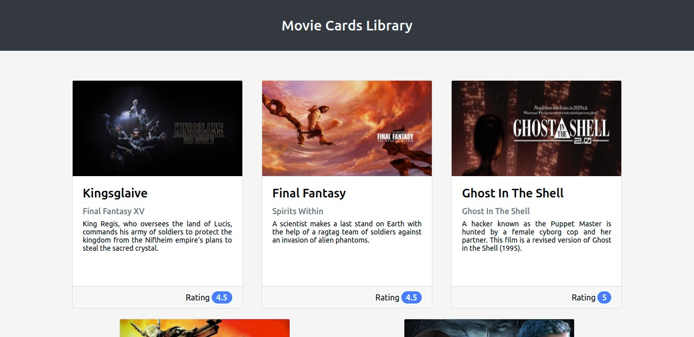

<h1 align="center">
  
</h1>

<h3 align="center">
  Curso realizado na Trybe - Edu Souza o/
</h3>

<blockquote align="center">“Aprender é a única coisa de que a mente nunca se cansa, nunca tem medo e nunca se arrepende - Leonardo da Vinci”</blockquote>

<h4 align="center">
  Repositório - Movie cards library
</h4>

 

  &nbsp;
  &nbsp;
  

  <a href="#rocket-Sobre-o-projeto">Sobre o projeto</a>&nbsp; &nbsp; |&nbsp; &nbsp;
  <a href="#postbox-Entrega"">Entrega</a>&nbsp; &nbsp; |&nbsp; &nbsp;
  <a href="#unlock-Licença">Licença</a>

## :rocket: Sobre o projeto

#### Movie cards library 

Você desenvolverá seu primeiro site usando React: uma biblioteca de cartões contendo informações sobre filmes.
Você vai criar uma pequena biblioteca com cartões informativos sobre filmes.

#### Screenshots:

   &nbsp;

## :postbox: Entrega

#### :clipboard: Requisitos

- 
<a href="#1"> :pushpin: 1.</a> Crie um componente chamado `Header`.

- 
<a href="#2"> :pushpin: 2.</a> Renderize o texto "Movie Cards Library" dentro de `Header`.

- 
<a href="#3"> :pushpin: 3.</a> Crie um componente chamado `MovieList`.

- 
<a href="#4"> :pushpin: 4.</a> Renderize componentes `MovieCard` dentro de `MovieList`.

- 
<a href="#5"> :pushpin: 5.</a> Passe uma key para cada `MovieCard` renderizado.

- 
<a href="#6"> :pushpin: 6.</a> Crie um componente chamado `MovieCard`.

- 
<a href="#7"> :pushpin: 7.</a> Renderize a imagem do filme.

- 
<a href="#8"> :pushpin: 8.</a> Renderize o título do filme.

- 
<a href="#9"> :pushpin: 9.</a> Renderize o subtítulo do filme.

- 
<a href="#10"> :pushpin: 10.</a> Renderize a sinopse do filme.

- 
<a href="#11"> :pushpin: 11.</a> Renderize um componente `Rating` dentro de `MovieCard`.

- 
<a href="#12"> :pushpin: 12.</a> Passe como prop para o componente `Rating` o atributo `rating`.

- 
<a href="#13"> :pushpin: 13.</a> Crie um componente chamado `Rating`.

- 
<a href="#14"> :pushpin: 14.</a> Renderize a nota de um filme dentro de `Rating`.

- 
<a href="#15"> :pushpin: 15.</a> `App` deve renderizar `Header`.

- 
<a href="#16"> :pushpin: 16.</a> `App` deve renderizar `MovieList`.

- 
<a href="#17"> :pushpin: 17.</a> Adicione proptypes a todos os componentes.

### Concluído :rocket:

Acesse o deploy do projeto [aqui](https://edusouza-programmer.github.io/Trybe_Projeto_11-3_Edu_Souza/).

#
## :unlock: Licença

Este projeto está licenciado sob a Licença MIT - consulte [LICENSE](https://opensource.org/licenses/MIT) para maiores detalhes.
